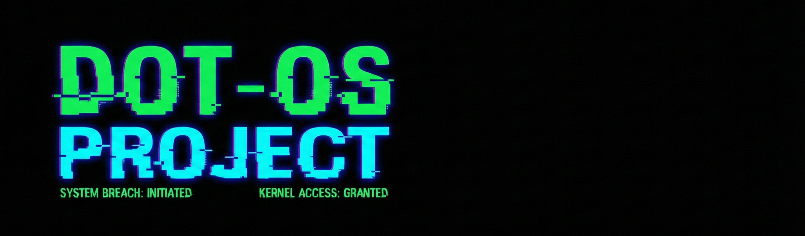

**SPEED. STABILITY. SIMPLICITY.**
*The ultimate environment for botting, mining, and automation.*

[ View Demo ](https://youtube.com/@DotAja) • [ Report Issue ](https://github.com/issues)

---

## 🏴 PROJECT OVERVIEW

**DOT AJA** is a specialized project focused on creating the most lightweight and efficient Linux environment possible. Whether you are running high-frequency trading bots, selenium automation, or managing a fleet of VPS instances, this OS provides the bare metal performance you need without the bloat.

### Why DOT AJA?
* **Minimal Overhead:** Idle RAM usage optimized to `<100MB`.
* **Developer Ready:** Pre-packed with Python, Git, and Network Tools.
* **Remote Access:** Custom RDP configuration for seamless GUI access.

---

## 🛠️ SYSTEM SPECS

* **OS Family:** Debian / Linux
* **Desktop Environment:** XFCE4 (Stripped Down)
* **Default Shell:** Bash
* **Package Manager:** APT
* **Pre-installed:** `python3`, `pip`, `wget`, `curl`, `git`, `htop`, `screen`

---

## 📺 ABOUT DOT AJA

**DOT AJA** is dedicated to Linux tutorials, scripting, and open-source projects. Join our community to stay updated with the latest tools and OS builds.

* **YouTube:** [DOT AJA Channel](https://youtube.com/@DotAja)
* **Focus:** Linux Scripting, VPS Tricks, Automation.

---

**Disclaimer:**
*This project is for educational purposes. Use at your own risk.*

*Copyright © 2026 DOT AJA*

